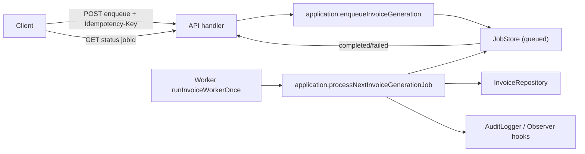

# GrantLedger Platform

If you've worked on SaaS products long enough, you've probably seen this happen: billing starts simple, then slowly becomes one of the hardest parts of the platform to change safely.

What used to be “just a few rules” turns into retries, partial failures, webhook replays, timezone edge cases, and business logic spread across handlers, jobs, and integrations.

> GrantLedger was built for that exact reality.

## Why This Project Exists

The goal is not to showcase architecture for its own sake.
The goal is to solve a common and recurring company problem: make billing workflows reliable, understandable, and evolvable as the product grows.

In practice, that means:
- keeping business rules explicit and testable;
- protecting write flows with idempotency and clear conflict behavior;
- validating contracts at the boundaries;
- handling async processing predictably (queue -> processing -> completion/failure);
- documenting architecture decisions so the system can evolve without losing coherence.

## Project Objective
GrantLedger is a practical foundation for multi-tenant SaaS billing where teams can ship features without accumulating hidden operational risk.

It aims to give product and engineering teams confidence that billing behavior is:

- consistent,
- auditable,
- resilient under retries/concurrency,
- maintainable over time.

## At a Glance

> Current status on `main`: architecture hardening stream delivered through `ARCH-012`; next planned focus is `ARCH-013`.

- domain rules stay pure and deterministic
- use cases orchestrate idempotency, retries, and audit flow
- API/worker layers adapt transport concerns without leaking business logic
- contracts are schema-first at boundaries
- architectural decisions are tracked and versioned via ADRs

## What Is Implemented Today

### Core capabilities

- Tenant-aware request context resolution with explicit auth/access failure semantics.
- Checkout orchestration through an application-level payment provider contract.
- Subscription state-machine commands with idempotent mutation orchestration.
- Webhook normalization + deduplication path with canonical event publishing contract.
- Schema-first invoice API contracts with Zod-inferred types to reduce contract drift.
- Unified shared datetime policy (Luxon-based) across invoice orchestration paths.
- Boundary-level payload normalization to reduce duplication and preserve API consistency.
- Replay controls and observer-based operational hooks for async invoice lifecycle monitoring.
- Async invoice generation flow across API + application + worker:
  - enqueue with `Idempotency-Key`
  - status polling by `jobId`
  - worker processing with retry scheduling and terminal dead-letter status

### Behavioral guarantees

- Standard API error envelope: `{ message, code, details?, traceId? }`
- Idempotency state model in application layer: `processing | completed | failed`
- Conflict safety:
  - same key + different payload -> `409`
  - same key while processing -> `409`
- Async invoice contract:
  - enqueue -> `202 Accepted` with `jobId`
  - status -> `queued | processing | completed | failed`
  - transient processing failures can return job to `queued` with retry reason

## Architecture

### Layer responsibilities

- `packages/domain`
  - entities, invariants, state transitions, deterministic calculations
  - no transport/framework/provider concerns
- `packages/application`
  - use-case orchestration, ports/interfaces, idempotency, retry/dead-letter flow
  - no HTTP-specific mapping
- `apps/api`, `apps/worker`
  - boundary validation, header/context resolution, error-to-transport mapping, workflow triggering
- `packages/contracts`
  - canonical types + Zod schemas for boundary contracts
- `packages/shared`
  - reusable cross-cutting helpers (`time`, `i18n`, idempotency fingerprinting, standard error body)

### Dependency direction

`apps/* -> application -> domain`  
`contracts` and `shared` are consumed as cross-cutting foundational packages.

### Repository layout

```txt
apps/
  api/
  worker/
  admin/

packages/
  domain/
  application/
  contracts/
  shared/

docs/
  architecture/
  adr/
```

## Async Invoice Flow (ARCH-009/010/011/012 Baseline)



## Monorepo Packages

- `@grantledger/domain`: business rules and invariants.
- `@grantledger/application`: use cases (`subscription`, `invoice`, `idempotency`, `payment-webhook`, `auth-context`, `checkout`).
- `@grantledger/contracts`: shared domain/app/API contracts and Zod schemas.
- `@grantledger/shared`: time policy (Luxon), i18n baseline (`en-US`), stable payload hashing, and standard error body helpers.
- `@grantledger/api` / `@grantledger/worker`: transport-facing orchestration adapters built as testable functions.

## Tech Stack

- Node.js `22.x`
- TypeScript (`strict`, project references, `exactOptionalPropertyTypes`)
- npm workspaces
- Zod (schema-first boundary validation)
- Luxon (timezone-safe datetime handling)
- Vitest + ESLint

## Local Setup

### Prerequisites

- Node.js `>=22 <23`
- npm `>=10 <11`

### Install

```bash
npm ci
```

### Full quality gate

```bash
npm run lint && npm run typecheck && npm run build && npm run test
```

## Testing Strategy

Current test scope is focused on business-critical behavior:

- `packages/application/src/**/*.test.ts`
  - idempotency core
  - subscription idempotency
  - webhook dedup behavior
  - invoice enqueue/process idempotency and retry lifecycle
- `apps/api/src/**/*.test.ts`
  - integration-style handler tests (auth, checkout, subscription, invoice, error mapping)
- `apps/worker/src/**/*.test.ts`
  - worker loop behavior (`idle`, `processed`, retry scheduling, dead-letter, observer-failure resilience)

## Governance and Architecture Discipline

Architecture changes follow an issue-driven stream (`ARCH-*`) with mandatory documentation updates.

- Tracker: `docs/architecture/ARCH-TRACKER.md`
- Guardrails: `docs/architecture/ARCH-GUARDRAILS.md`
- Roadmap: `docs/architecture/IMPROVEMENT-ROADMAP.md`
- Contribution guideline: `CONTRIBUTING.md`
- PR checklist: `.github/pull_request_template.md`

### ADR set (accepted)

- `ADR-005` Domain vs Application boundary
- `ADR-006` Schema-first validation with Zod
- `ADR-007` Timezone-safe datetime policy (Luxon)
- `ADR-008` Standard error model and centralized API mapping
- `ADR-009` Generic idempotency executor
- `ADR-010` i18n foundation (`en_US` baseline)
- `ADR-011` Idempotency state machine + concurrency behavior
- `ADR-012` Classes vs functions guideline
- `ADR-013` Async idempotent invoice rollout
- `ADR-014` Durable invoice async infrastructure strategy
- `ADR-015` Invoice async operational readiness (observability + replay controls)
- `ADR-016` Schema-first contracts, unified time policy, and boundary dedup polish

## Current Trade-offs and Next Steps

- The repository still prioritizes deterministic in-memory adapters in key paths; a deeper durable production profile can continue in future streams.
- Operational semantics (retry, backoff, dead-letter, replay controls, observer-safe notifications) are now modeled and documented across ARCH-010/011/012.
- Contract drift risk was reduced by schema-first invoice boundaries, but broader schema-first consolidation can continue incrementally.
- Next architecture step (`ARCH-013`) should build on this baseline while preserving the public contracts stabilized in ARCH-009+.

## Project Links

- Repository: [john-dalmolin/grantledger-platform](https://github.com/john-dalmolin/grantledger-platform)
- Project board: [GitHub Project #6](https://github.com/users/john-dalmolin/projects/6)

## Acknowledgments

Special thanks to [Marcos Pont](https://github.com/marcospont) for all the support, advice, and feedback throughout this project.
His guidance was fundamental to shaping and improving GrantLedger.

## References

- HTTP Semantics (RFC 9110): [https://www.rfc-editor.org/rfc/rfc9110](https://www.rfc-editor.org/rfc/rfc9110)
- Zod documentation: [https://zod.dev](https://zod.dev)
- Luxon documentation: [https://moment.github.io/luxon](https://moment.github.io/luxon)
